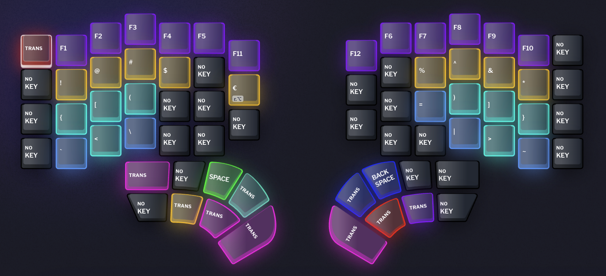

# Keyboard Layout Documentation

## Overview

This keyboard layout is designed for seamless operation across both Windows and macOS environments. To achieve consistent behavior across platforms:

-   Both operating systems are configured to use EURKey 1.3 keyboard layout
-   On macOS, Ctrl and Cmd modifiers are switched in system settings
-   Layers and shortcuts are designed to work identically regardless of the operating system
-   Special consideration has been given to maintain consistent modifier behavior
-   Modifier keys are placed in thumbclusters instead of using Homerow mods or Superkeys for better control and reduced accidental triggers

The layout provides comprehensive multi-language support:

-   Includes all necessary characters for Czech, Portuguese, and German languages
-   Implements custom macros for efficient diacritic combinations
-   Maintains consistent typing experience across different languages
-   Diacritic characters are accessible through intuitive key combinations

## Layout Screenshots

### 1. Layer 1 - Colemak-DH

-   Base layer using Colemak-DH layout for efficient typing
-   Numeric row removed from the top for improved ergonomics and reduced finger stretching
-   Arrow keys positioned in the top left corner of the right half for easy navigation
-   Escape key in traditional top-left corner position (no Vim here!)
-   Special function keys:
    -   Bluetooth pairing key for connecting to different devices
    -   Battery level indicator key to check remaining power
    -   LED toggle key to control keyboard backlighting
-   Special shortcuts:
    -   Shift+Alt+F: Formats PHP code for improved readability
    -   Ctrl+Cmd+Space:
        -   Triggers Homerow application on macOS
        -   Accidentally switches keyboard layouts on Windows (oops!)
    -   Superkey for Copy/Paste operations (thanks to Dygma team for this brilliant idea!):
        -   Works with both Windows (Ctrl+C/V) and Mac (Cmd+C/V) shortcuts
        -   No need to change modifier keys when switching between operating systems
-   Special characters based on standard Czech layout (some habits die hard) and PHP scripting:
    -   Semicolon (;)
    -   Apostrophe (')
    -   Comma (,)
    -   Full stop (.)
    -   Hyphen (-)
-   Thumbcluster configuration:
    -   Left thumb:
        -   Space (tap) / Layer 6 modifier (hold)
        -   Tab
        -   Alt modifier
        -   One-Shot Layer 2 modifier (temporary layer activation)
        -   Layer 4 modifier
    -   Right thumb:
        -   Enter
        -   Backspace (tap) / Layer 6 modifier (hold)
        -   Delete
        -   Layer 3 modifier
        -   Layer 5 modifier
        -   Layer 9 modifier

### 2. Layer 2 - Numpad and navigation

-   Escape key remains transparent from Layer 1, retaining its standard function
-   Navigation cluster on the left half:
    -   Arrow keys in ESDF position for natural finger placement
    -   Page Up/Down for quick document scrolling
    -   Home/End keys for line navigation
    -   Blue keys for macOS workspace navigation:
        -   Cmd+Left/Right to switch between workspaces
-   Numpad layout on the right half:
    -   NUM LOCK key, just in case the computer does not turn it on
    -   Traditional calculator-style number arrangement (7-8-9 on top)
    -   Mathematical operators (+, -, \*, /)
    -   No dedicated NUM_ENTER key - the standard thumb Enter key is used instead
    -   Zero (0) key placed in thumb cluster to match traditional numpad ergonomics
    -   Decimal dot as standard separator for numerical input, positioned next to zero on thumb cluster, however usually ends up operated by index finger
    -   Additional special characters:
        -   Percent sign (%)
        -   Equal sign (=)
        -   Comma (,) used as decimal separator in local settings
        -   Underscore (\_)
        -   Colon (:)
-   Thumbcluster configuration:
    -   Left thumb:
        -   Most keys are transparent, maintaining their Layer 1 functions
        -   Layer 6 modifier's dual function is replaced by Shift's dual function
        -   One-Shot Layer 2 modifier position is transparent to enable One-Shot functionality
        -   Layer 4 modifier is removed as it does not make sense in a numpad layout
    -   Right thumb:
        -   Most keys are transparent, maintaining their Layer 1 functions
        -   Layer 6 modifier's dual function is replaced by Shift's dual function

### 3. Layer 3 - F-keys and Special characters

-   Function keys (F1-F12) accessibility
-   Special characters from standard number row:
    -   Yellow keys mirror the symbols from shifted standard number row
    -   Repositioned for optimal four-finger operation
    -   More ergonomic access compared to reaching for the number row
-   Parentheses on homerow:
    -   Opening parentheses (, [, {, < positioned on the left side
    -   Closing parentheses ), ], }, > positioned on the right side
    -   Intuitive left-right pairing for easier typing
    -   Located on homerow for maximum efficiency
-   Thumbcluster configuration:
    -   Maintains transparent functionality from Layer 2 (numpad and navigation)
    -   All modifier keys and special functions remain consistent
    -   Seamless transition between layers while maintaining thumb controls

### 4. Layer 4 - Diacritics with acute and grave accent

-   Acute accent is primary accent for the layer, based on Czech language preference
-   Letters with acute accent are placed in Colemak-DH positions
    -   á, é, í, ö, ú, ý
-   Letters with grave accent are placed in the next available position, preferably above the letter with acute accent
    -   à
-   German letter ß is treated as acute accent and is placed in Colemak-DH position
    -   ß
-   Thumbcluster configuration:
    -   Does not use standard modifier keys
    -   Only allow for Space, Backspace, and Enter
    -   Layer 5 modifier for other diacritics
    -   Layer 7 modifier for upper case letters

### 5. Layer 5 - Diacritics with other accents

-   Caron accent is primary accent for the layer, based on Czech language preference
-   Letters with caron accent are placed in Colemak-DH positions
    -   č, ď, ě, ň, ř, š, ť, ž
-   Czech letter ů is treated as caron accent and is placed in Colemak-DH position
    -   ů
-   Portuguese letters with tilde are placed in Colemak-DH positions
    -   ã, õ
-   Portuguese letters with circumflex accent are placed in the next available position, preferably below the letter with tilde, however on left side the position is taken, so it is placed above the letter with tilde
    -   â, ê, ó
-   German letters with umlauts are placed on the left side of Colemak-DH positions
    -   ä, ö, ü
-   Portuguese letter ç is treated as umlaut and is placed on the left side of Colemak-DH position
    -   ç
-   Thumbcluster configuration:
    -   Similar to Layer 4 - minimal modifiers
    -   Space, Backspace, and Enter retained
    -   Layer 4 modifier for acute/grave accents
    -   Layer 8 modifier for uppercase variants

### 6. Layer 6 - Uppercase Colemak-DH

-   Uppercase version of the base Colemak-DH layout
-   Special characters based on standard Czech layout and PHP scripting:
    -   Double quote (")
    -   Question mark (?)
    -   Colon (:)
    -   Underscore (\_)
-   Shifted function of arrow keys
-   Thumbcluster configuration:
    -   Based on Layer 1 thumbcluster configuration
    -   Adds shift modifier to Space, Tab, Enter, Backspace and Delete

### 7. Layer 7 - Uppercase diacritics with acute and grave accents

-   Capitalized characters from Layer 4

### 8. Layer 8 - Uppercase diacritics with other accents

-   Capitalized characters from Layer 5

### 9. Layer 9 - Mouse function and number row

-   Mouse control layout:
    -   Left side dedicated to cursor movement
    -   Left mouse button positioned on right side for index finger operation
        -   More precise control with dominant index finger
        -   Reduces strain on thumb compared to traditional mouse designs
    -   Additional mouse buttons follow natural finger positions
    -   Right side handles scrolling functions:
        -   Vertical and horizontal mouse wheel scrolling
        -   Browser back/forward navigation buttons
        -   Complete mouse control without leaving the keyboard
-   Number row accessibility (0-9):
    -   Essential for Bluetooth pairing process:
        -   Required for entering pairing keys
        -   Prevents common connectivity issues when users forget about number keys
    -   Compatibility with standard Czech QWERTY layout:
        -   Number row used for diacritic letters in Czech layout
        -   White keys in inner column provide acute and caron accents for miscellaneous letters in Czech language
        -   Critical for Remote Desktop sessions where local layout may differ
